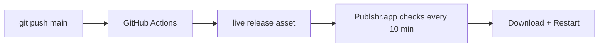

# Install once · auto-update forever

## Stable install (always the same command)

```bash
curl -fsSL "https://raw.githubusercontent.com/hiagoccss-svg/publshr.exe/refs/heads/main/install-publshr.sh" | bash
```

- **One file** at a fixed URL: `install-publshr.sh` on branch `main` (logic is not split across moving scripts).
- Downloads the **`live`** release: `Publshr-macos-aarch64.tar.gz` (fixed asset name).
- If `live` is not ready yet, builds from GitHub `main` (requires Xcode).

## Push to GitHub → your live app updates



1. Every push to **`main`** runs `.github/workflows/deliver-macos.yml`.
2. CI builds `Publshr.app` and uploads to the **`live`** release (same filenames every time).
3. Your installed app checks the `live` release, compares **build numbers**, downloads, and replaces `/Applications/Publshr.app` when you click **Restart to update** (or via menu).

No Terminal reinstall after the first install.

## Channels

| Channel | Tag | Asset (Apple Silicon) | Used by |
|---------|-----|------------------------|---------|
| **Live** | `live` | `Publshr-macos-aarch64.tar.gz` | Installer + auto-updater |
| Versioned | `v0.2.0.42` | `publshr-0.2.0.42-macos-aarch64.tar.gz` | History / rollback |

## Requirements

- Mac with network access to `github.com`
- App in `/Applications/Publshr.app`
- For source fallback: Xcode + Swift

## Logs

`~/Library/Application Support/Publshr/updates/last-update.log`
