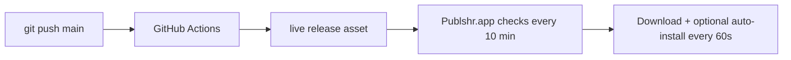

# Install once · auto-update forever

## Stable install (always the same command)

```bash
curl -fsSL "https://raw.githubusercontent.com/hiagoccss-svg/publshr.exe/refs/heads/main/install-macos.sh" | bash
```

- **One file** at a fixed URL: `install-publshr.sh` on branch `main` (logic is not split across moving scripts).
- Downloads the **`live`** release: `Publshr-macos-aarch64.tar.gz` (fixed asset name).
- If `live` is not ready yet, builds from GitHub `main` (requires Xcode).

## Push to GitHub → your live app updates



1. Every push to **`main`** runs `.github/workflows/deliver-macos.yml`.
2. CI builds `Publshr.app` and uploads to the **`live`** release (same filenames every time).
3. Your installed app checks the `live` channel every **60 seconds** via `VERSION.txt` (and when the app becomes active or wakes from sleep). It compares **build number**, **full version**, **git commit**, and **package digest**, verifies the tarball **SHA-256** against `VERSION.txt` line 4, then downloads the complete app bundle (icons, colors, Swift UI, features). **Settings → Updates** toggles control check and auto-install; when auto-install is off, the build is downloaded but you choose when to install. Installs to `~/Applications/Publshr.app` are **passwordless**; system `/Applications` uses **one** administrator prompt per update (not three).
4. **Settings** (bottom panel): **Download and install latest** runs the same full check → download → install → restart flow manually.
5. Every push to **`main`** publishes a new `live` build (monotonic CI build number). Icon changes at repo root are synced before packaging.
6. CI runs **macOS compile check** on every PR and `main` push so broken builds do not block the `live` channel.

Chat and Spaces data load from Supabase on sign-in and refresh every 5 minutes (plus on wake/network restore).

## Channels

| Channel | Tag | Asset (Apple Silicon) | Used by |
|---------|-----|------------------------|---------|
| **Live** | `live` | `Publshr-macos-aarch64.tar.gz` | Installer + auto-updater |
| Versioned | `v0.2.0.42` | `publshr-0.2.0.42-macos-aarch64.tar.gz` | History / rollback |

## Requirements

- Mac with network access to `github.com`
- App in `/Applications/Publshr.app`
- For source fallback: Xcode + Swift

## Transactional install

`apply-macos-update.sh` (bundled in the app) performs:

1. Wait for the running app to exit
2. **Backup** the current `/Applications/Publshr.app` to Application Support
3. **Replace** the app with `ditto`
4. **Verify** the new binary exists; **rollback** from backup on failure
5. Relaunch Publshr

User data (`~/Library/Application Support/Publshr/`) is never modified during updates.

## Logs

`~/Library/Application Support/Publshr/updates/last-update.log`
