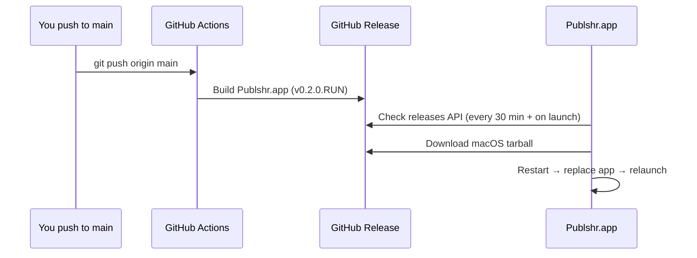

# Auto-update from GitHub

After a **one-time install**, Publshr checks GitHub Releases and updates `/Applications/Publshr.app` for you. You do not need to run Terminal or reinstall manually when you push to `main`.

## How it works



1. **CI** — workflow `.github/workflows/deliver-macos.yml` runs on every push to `main` that touches `mac/publshr/`. It builds on `macos-14` and publishes `publshr-<version>-macos-aarch64.tar.gz` with tag `v<VERSION>.<run>` (e.g. `v0.2.0.42`).
2. **Installed app** — reads `CFBundleVersion` (build number) and compares to the newest GitHub release. If a newer build exists, it downloads the asset, extracts it, runs `apply-macos-update.sh`, quits, replaces the app, and opens the new build.
3. **UI** — banner at the top when an update is ready; status bar shows version / “Check for updates”; menu **Publshr → Check for Updates…**

## One-time install (Mac)

```bash
curl -fsSL https://raw.githubusercontent.com/hiagoccss-svg/publshr.exe/main/install-publshr.sh | bash
```

Or from a clone:

```bash
cd mac/publshr && sudo bash install.sh
```

## Version numbers

| File / key | Meaning |
|------------|---------|
| `mac/publshr/VERSION` | Marketing semver base (e.g. `0.2.0`) |
| CI `GITHUB_RUN_NUMBER` | Build id appended as `0.2.0.42` |
| `CFBundleShortVersionString` | Base from `VERSION` |
| `CFBundleVersion` | Build number (used for update comparison) |

## Manual release tags

Tagged releases (`v*` tags) still use `.github/workflows/release.yml` for formal Linux + macOS tarballs. Continuous delivery on `main` is separate and is what the app prefers for day-to-day updates.

## Requirements

- Mac must reach `api.github.com` and `github.com`
- App installed to `/Applications/Publshr.app` (default)
- Apple Silicon asset (`aarch64`) on M-series Macs; Intel Macs need an `x86_64` release asset (add a CI matrix row if needed)

## Troubleshooting

- **No update after push** — confirm the workflow succeeded on `main` and a new release appears under [Releases](https://github.com/hiagoccss-svg/publshr.exe/releases).
- **Gatekeeper** — first install may require right-click → Open; updates use `ditto` into `/Applications`.
- **Logs** — `~/Library/Application Support/Publshr/updates/last-update.log`
