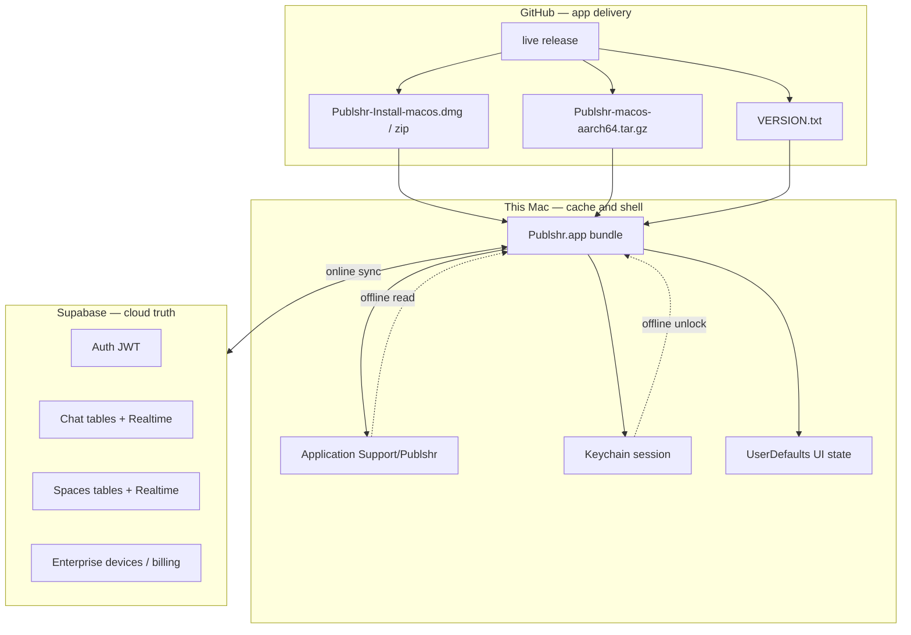

# Data architecture — GitHub, Mac, Supabase

## What you need for the app to work

| Required | Purpose |
|----------|---------|
| **GitHub `live`** | Deliver and update `Publshr.app` (`VERSION.txt` + tarball) |
| **Supabase** | Auth, chat, spaces, enterprise data (source of truth) |
| **Network** | Reach both when online |

**Not required:** pre-existing files on the Mac, manual SQLite setup, or a local server. Application Support is an **optional cache** for speed and brief offline reading — delete it and sign in again; data comes back from Supabase.

Verify both clouds:

```bash
cd mac/publshr && bash scripts/verify-cloud-ready.sh
```

Enterprise Publshr splits responsibility across three tiers. Nothing in this model stores Supabase service keys in the installer; users authenticate after install.

## Three tiers



| Tier | Owns | Never owns |
|------|------|------------|
| **GitHub `live`** | App binary, icons, shell tag, build metadata, package SHA-256 | User messages, workspaces, passwords |
| **Mac** | SQLite cache, drafts, voice note files, update staging, window layout | Authoritative multi-user data |
| **Supabase** | Profiles, workspaces, chat, spaces, devices, subscriptions | App binary or local UI prefs |

## Install (one-time download)

| Step | What happens |
|------|----------------|
| User downloads | `Publshr-Install-macos.dmg` or zip from **`live`** |
| Installer copies | Only `Publshr.app` → `~/Applications/Publshr.app` (recommended) |
| Preserved | Entire `~/Library/Application Support/Publshr/` if reinstalling |

The DMG/zip contains the **full app skeleton** (Swift UI, embedded update script, Supabase client config). It does **not** contain tenant data.

## Online — two parallel loops (every 30 seconds)

| Loop | Source | Action |
|------|--------|--------|
| **GitHub live** | `VERSION.txt` + tarball | Compare build/version/commit/shell/digest → download → verify SHA-256 → replace **only** `Publshr.app` |
| **Supabase cloud** | REST + Realtime | Refresh auth, chat, spaces, subscription, devices |

Triggers also fire on: app active, wake, network restore, **Sync now**, sign-in.

Settings → **Updates** shows both lines separately (GitHub vs cloud).

## Offline — what still works

| Data | Location | Offline behavior |
|------|----------|------------------|
| Session tokens | Keychain (`com.publshr.app.auth`) | Biometric unlock if enabled |
| Profile / workspaces snapshot | `auth-offline-snapshot.json` | Read-only workspace list |
| Chat channels, messages, drafts | `chat-cache.sqlite` (WAL) | Read cache; send shows failure until online |
| Spaces list + tasks (cached space) | `spaces-cache.sqlite` (WAL) | Read cache for last workspace |
| Voice notes | `voice-notes/{workspace}/{channel}/` | Play local files |
| UI layout, filters, toggles | UserDefaults | Full |

**Cloud source of truth** when back online: Supabase. Local SQLite is a **cache**, not a second database of record.

## On-disk layout (Mac)

All under `~/Library/Application Support/Publshr/` (see `LocalDataLayout.swift`):

| Path | Tier | Purpose |
|------|------|---------|
| `chat-cache.sqlite` | Mac cache | Chat offline + search index |
| `spaces-cache.sqlite` | Mac cache | Spaces/tasks cache |
| `auth-offline-snapshot.json` | Mac cache | Offline profile/workspaces |
| `voice-notes/` | Mac files | Local recordings |
| `updates/` | Mac / GitHub | Downloaded tarballs, staging, logs |
| `crashes/` | Mac diagnostics | Last crash log |
| `install-source.tree` | Installer | Bundled tree path (diagnostics) |

**Keychain** (separate): access/refresh tokens — not in Application Support.

**UserDefaults** (separate): sidebar, window frames, update toggles, chat prefs — preserved across app updates.

## App update — what is never deleted

`apply-macos-update.sh` replaces **only** the app bundle. It does **not** touch:

- Application Support
- Keychain (unless user signs out)
- UserDefaults
- User-picked file bookmarks

## Speed practices

- SQLite **WAL** + `synchronous=NORMAL` on chat/spaces DBs
- Cloud sync runs **chat**, **spaces**, and **enterprise** work in parallel after auth refresh
- Realtime subscriptions stay active while online (push deltas, fewer full fetches)
- GitHub checks use `reloadIgnoringLocalCacheData` for `VERSION.txt`

## Roadmap (not yet implemented)

- Durable **chat outbox** in SQLite for offline send queue
- Broader **Spaces** offline cache (folders, documents, whiteboards)
- Server push notifications for offline devices

## Related docs

- [ENTERPRISE_INSTALL_AND_LIVE.md](./ENTERPRISE_INSTALL_AND_LIVE.md) — installer + live channel
- [AUTO_UPDATE.md](./AUTO_UPDATE.md) — `VERSION.txt` and transactional update
- [ENTERPRISE_PLATFORM.md](./ENTERPRISE_PLATFORM.md) — Supabase enterprise tables
- [CHAT_SYSTEM.md](./CHAT_SYSTEM.md) — chat schema and realtime
