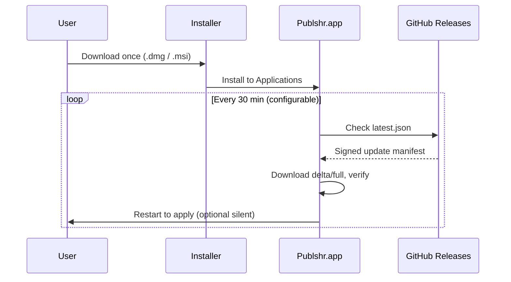

# Publshr Enterprise Desktop Platform (Tauri)

## Direction

Publshr is consolidating satellite desktop modules onto a **single native shell** built with **Tauri 2** (not Electron), with:

- **React + TypeScript + Tailwind** renderer
- **Rust** for auth, secure storage, and OS integration
- **SQLite** (`@tauri-apps/plugin-sql`) for offline cache and sync queue
- **Supabase** for auth, realtime, and cloud data
- **Tauri updater** + GitHub Releases — **install once**, update in place

Legacy Electron apps (`desktop/spaces`, `desktop/media-monitoring`, `planner/desktop`) remain until each module is ported. The native macOS IDE (`mac/publshr`) continues on the `live` channel.

## Stability priorities (in order)

1. Installer works once; user data preserved under app data dir
2. Auto-update (Tauri updater) without reinstall
3. Persistent login (OS keychain via `keyring` crate)
4. Local SQLite cache + sync queue
5. Native window chrome (overlay title bar, no browser artifacts)
6. New features only after the above are reliable

## Repository layout

| Path | Role |
|------|------|
| `desktop/enterprise/` | Canonical Tauri app (`com.publshr.enterprise`) |
| `shared/desktop/` | Shared TypeScript contracts (auth snapshot, env names) |
| `shared/design/` | Glass / matte UI tokens (used by renderer CSS) |
| `.github/workflows/deliver-enterprise.yml` | CI build + release artifacts |

## Install + update flow



User data: `~/Library/Application Support/com.publshr.enterprise/` (macOS) — **never** deleted by updates.

### Updater signing

Generate keys once per release channel:

```bash
cd desktop/enterprise
npm run tauri signer generate -- -w ~/.tauri/publshr-enterprise.key
```

Add the public key to `src-tauri/tauri.conf.json` under `plugins.updater.pubkey` before enabling production auto-update.

## Session + auth

- Tokens stored in **OS keychain** (`keyring`), not `localStorage`
- Renderer Supabase client: `persistSession: false`
- Rust commands: `auth_get_state`, `auth_save_session`, `auth_clear_session`
- Token refresh: `onAuthStateChange` → persist back to keychain

Planner Electron was updated to the same **main-process session file** pattern (interim until Planner moves into Tauri).

## Local storage

SQLite file: `enterprise.db` (app config directory)

Tables (v1 migration):

- `sync_queue` — offline writes
- `app_kv` — preferences and small blobs
- `window_states` — layout persistence

## Development

```bash
cd desktop/enterprise
cp .env.example .env   # optional Supabase
npm install
npm run dev            # tauri dev — native window + Vite HMR
npm run typecheck
npm run dist           # production build (requires platform deps)
```

### Linux prerequisites

```bash
sudo apt-get install -y libwebkit2gtk-4.1-dev librsvg2-dev patchelf
```

## Migration order (Electron → Tauri)

1. **Media Monitoring** — best auth/sync reference
2. **Planner** — auth fix landed in Electron; port UI next
3. **Spaces** — largest surface + Swift parity (`shared/spaces/PARITY.md`)

## Related

- [DESKTOP_WORKFLOW.md](../../../desktop/docs/DESKTOP_WORKFLOW.md) — legacy Electron workflow
- [ENTERPRISE_DESKTOP.md](./ENTERPRISE_DESKTOP.md) — native macOS IDE
- [ENTERPRISE_INSTALL_AND_LIVE.md](./ENTERPRISE_INSTALL_AND_LIVE.md)
