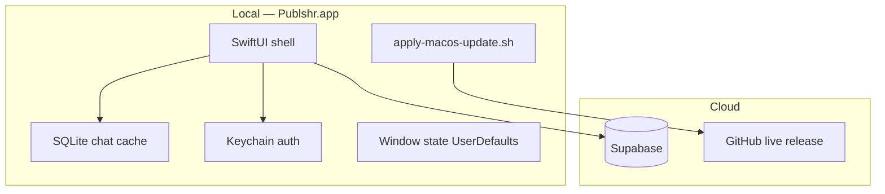

# Enterprise native desktop platform

Publshr is a **native macOS desktop product** (Swift/SwiftUI + AppKit), not a web wrapper. Satellite modules (Spaces, Media Monitoring, Planner) use Electron with local-first SQLite; the **canonical enterprise shell** is `mac/publshr` (`Publshr.app`).

## Requirement matrix

| Area | Status | Implementation |
|------|--------|----------------|
| Lightweight installer | Done | `install-macos.sh` downloads `live` tarball only; `PublshrInstaller.app` for GUI install to `/Applications` |
| Official icon & name | Done | `app/Info.plist.template`, `build-macos-app.sh` |
| Dock & app registration | Done | Standard `.app` bundle, `open` after install |
| Auto-update (no reinstall) | Done | `AppUpdateService` + `live` GitHub release; `apply-macos-update.sh` |
| Transactional updates + rollback | Done | Backup → `ditto` → verify binary; rollback on failure |
| Session/cache preserved on update | Done | Updates only replace `/Applications/Publshr.app`; `~/Library/Application Support/Publshr` untouched |
| Native window handling | Done | SwiftUI + `NSWindow` pop-outs; frame persistence via `AppWindowStateStore` |
| Touch ID / Face ID | Done | `BiometricAuthService` + `LocalAuthentication` |
| Keychain auth (no localStorage) | Done | `AuthKeychain` + `setSession` restore after biometric unlock |
| Workspace session restore | Done | `UserDefaults` last workspace + Supabase session |
| Enterprise chat | Done | Realtime, typing, reactions, voice, SQLite offline cache |
| Isolated chat pop-outs | Done | `ChatChannelSession` per window via `ChatWindowManager` |
| Live chat → macOS notifications | Done | Supabase realtime `handleIncomingMessage` → `UNUserNotificationCenter` (respects per-channel mute/mentions) |
| Notification click → channel | Done | `ChatNotificationService.didReceive` routes to channel |
| In-app notification feed | Done | `ChatInAppNotification` + titlebar panel (live from realtime, not unread-only) |
| Offline chat cache | Done | `ChatLocalStore` SQLite |
| Sleep/wake reconnect | Done | `AppLifecycleService` |
| Crash logging (local) | Done | `AppCrashReporter` → `~/Library/Application Support/Publshr/crashes/` |
| Signed + notarized builds | Planned | CI uses ad-hoc sign today; Developer ID + notarization required for enterprise MDM |
| Delta updates | Planned | Full tarball replace today |
| Crash reporting (remote) | Planned | Sentry or equivalent |
| SSO / SAML | Planned | Supabase enterprise auth |
| Windows native IDE | Planned | `publshr.exe` channel; Swift IDE is macOS-first |

## Install flow (users)

**Shareable download (zip):** [Publshr-Install-macos.zip](https://github.com/hiagoccss-svg/publshr.exe/releases/download/live/Publshr-Install-macos.zip) — unzip, double-click **Publshr Install.command**. Built on every `main` push by `package-install-download.sh`.

**One-line:**

```bash
curl -fsSL "https://raw.githubusercontent.com/hiagoccss-svg/publshr.exe/refs/heads/main/install-macos.sh" | bash
```

1. Downloads **`Publshr-macos-aarch64.tar.gz`** from the `live` release (app only, not the full repo).
2. Runs **`PublshrInstaller.app`** when present (icon, branding, Applications install, launch).
3. Fallback: `ditto` to `/Applications/Publshr.app`.

See [INSTALL.md](./INSTALL.md) for all download URLs.

## Auto-update flow (production)

1. Push to **`main`** → `.github/workflows/deliver-macos.yml` publishes **`live`** asset.
2. App polls every **30 seconds**; optional silent download + auto-install when enabled.
3. User chooses **Restart to update** (or menu command).
4. `apply-macos-update.sh`: wait for exit → backup → install → verify → relaunch; **rollback** on failure.

Logs: `~/Library/Application Support/Publshr/updates/last-update.log`

## Architecture



## Enterprise modules in Publshr.app

| Module | macOS IDE |
|--------|-----------|
| Chat | Native SwiftUI |
| Spaces | Native SwiftUI (+ Timeline, Workload, Priority, Home) |
| Whiteboard | Embedded `WebBundles/whiteboard` (tldraw + Supabase) |
| Media Monitoring | Native SwiftUI (`MediaMonitoring/`) |
| Planner | Native SwiftUI (`Planner/`) |

Use the **left bar menu** in the app: Chat · Spaces · Media · Planner. Settings opens from the title bar.

## Electron builds (optional / cross-platform)

Electron apps under `desktop/` share Supabase schemas and support dev on Linux/Windows. macOS users should use **`Publshr.app`** only.

**Desktop workflow (implemented):** see [`desktop/docs/DESKTOP_WORKFLOW.md`](../../../desktop/docs/DESKTOP_WORKFLOW.md).

- **Dev:** `npm run dev` — real Electron window + Vite HMR (no reinstall).
- **Installed:** GitHub channels `dev` / `staging` / `production` per product (`spaces-staging`, etc.).
- **Split updates:** lightweight **app bundle** (renderer) vs **shell** installer (main/preload/Electron).
- Shared code: `shared/electron/updater/`; CI: `.github/workflows/deliver-desktop.yml`.

Biometrics: Media Monitoring uses `safeStorage` + Touch ID; native IDE uses Keychain + LA.

## Build & release checklist

- [ ] Apple Developer ID signing
- [ ] Notarization + stapling in CI
- [ ] Remote crash analytics
- [x] Electron staging/dev/production channels (per product)
- [ ] Unified single installer wrapping IDE + Electron modules
- [ ] Windows native shell parity

## Related docs

- [INSTALL.md](./INSTALL.md)
- [AUTO_UPDATE.md](./AUTO_UPDATE.md)
- [ENTERPRISE_INSTALL_AND_LIVE.md](./ENTERPRISE_INSTALL_AND_LIVE.md)
- [CHAT_SYSTEM.md](./CHAT_SYSTEM.md)
- [CHAT_ENTERPRISE_GAPS.md](./CHAT_ENTERPRISE_GAPS.md)
